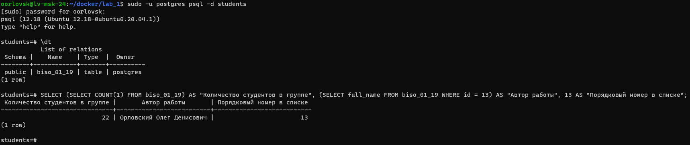
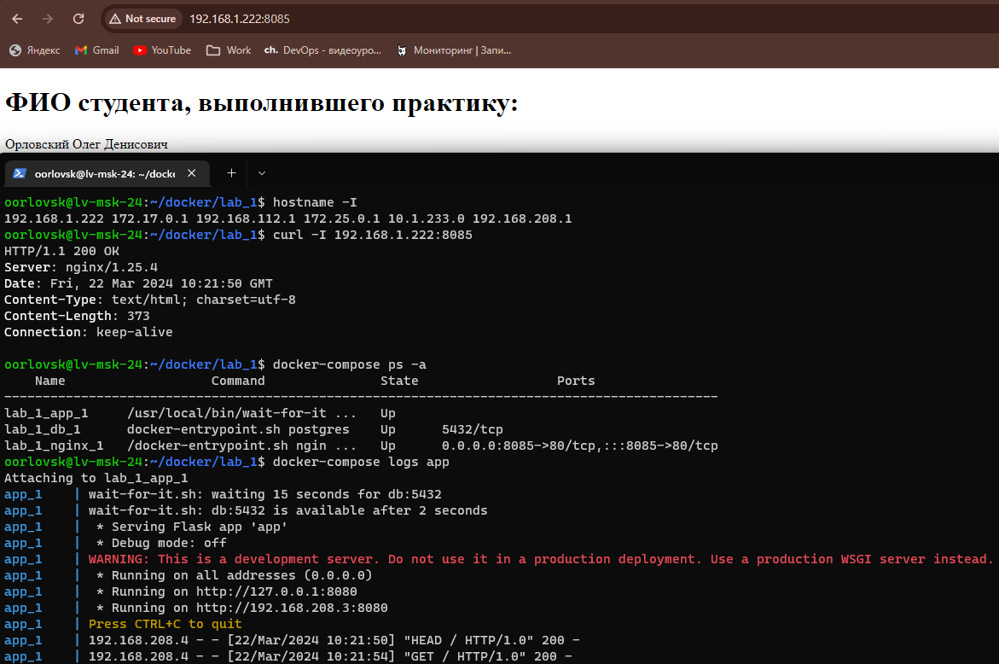

## Содержание

- [Структура проекта](#структура-проекта)
- [Описание файлов и каталогов](#описание-файлов-и-каталогов)
- [Инструкция](#инструкция)
- [Скриншоты](#скриншоты)

## Структура проекта

```
├── app
│   ├── app.py
│   ├── requirements.txt
│   └── templates
│       └── index.html
├── docker-compose.yml
├── Dockerfile.app
├── Dockerfile.nginx
├── Dockerfile.postgres
├── nginx
│   └── nginx.conf
├── postgres-data
│   ├── public_key.asc
│   └── students.sql.gpg
├── README.md
├── start.sh
├── stop.sh
└── wait-for-it.sh
```

## Описание файлов и каталогов

- **app/**: Каталог с исходным кодом приложения.
  - **app.py**: Главный файл приложения.
  - **requirements.txt**: Файл зависимостей Python для приложения.
  - **templates/**: Каталог с шаблонами веб-приложения.
    - **index.html**: Главная страница веб-приложения.
- **docker-compose.yml**: Файл для настройки контейнеров Docker и их взаимодействия.
- **Dockerfile.app**: Dockerfile для сборки контейнера приложения.
- **Dockerfile.nginx**: Dockerfile для сборки контейнера Nginx.
- **Dockerfile.postgres**: Dockerfile для сборки контейнера PostgreSQL.
- **nginx/**: Каталог с конфигурацией Nginx.
  - **nginx.conf**: Файл конфигурации Nginx.
- **postgres-data/**: Каталог с данными PostgreSQL.
  - **public_key.asc**: Публичный ключ для шифрования данных PostgreSQL.
  - **students.sql.gpg**: Зашифрованная версия дампа PostgreSQL.
- **README.md**: README.
- **start.sh**: Сценарий для запуска контейнеров.
- **stop.sh**: Сценарий для остановки контейнеров.
- **wait-for-it.sh**: Скрипт для ожидания доступности определенного хоста и порта перед запуском приложения.

## Инструкция

Для запуска проекта выполните следующие шаги:

1. Убедитесь, что Docker установлен на вашем компьютере.
2. Запустите команду `./start.sh`, чтобы запустить контейнеры.
3. После завершения работы вы можете остановить контейнеры с помощью команды `./stop.sh`.

## Скриншоты

- **Скриншот данных БД**:

  

- **Скриншот работы сайта**:

  

